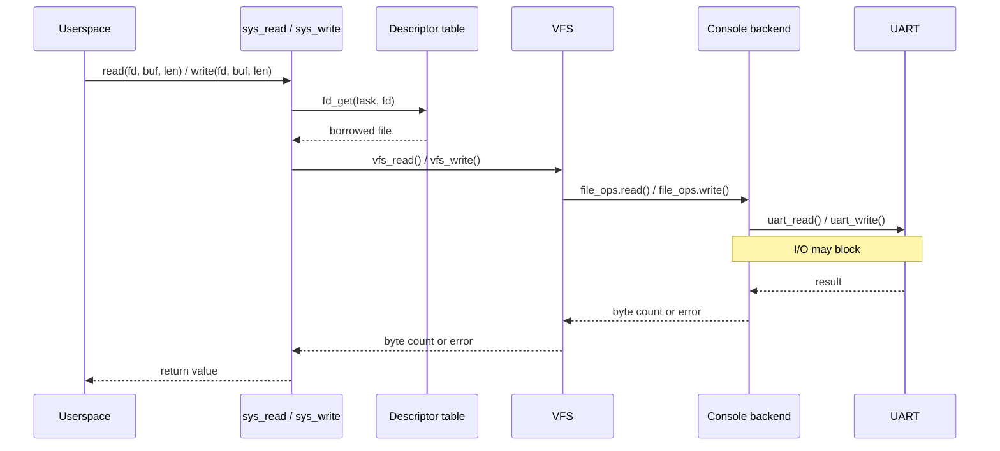
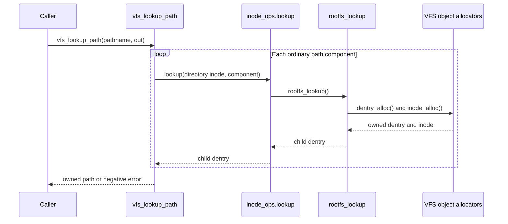

# Filesystem {#filesystem}

The virtual filesystem layer separates pathname lookup, open-file state, and
backend-specific operations. The current rootfs is read-only, while the UART
console is exposed as a pathless file backend.

## Object model

| Object | Purpose |
| --- | --- |
| `fs_type` | Describes a filesystem implementation and its mount callback. |
| `mount` | Represents a mounted filesystem. |
| `superblock` | Stores state shared by one filesystem instance. |
| `dentry` | Associates a name and parent with an inode. |
| `inode` | Stores object type, size, operations, and backend data. |
| `path` | Identifies a dentry within a mount. |
| `file` | Stores state belonging to one open file. |
| Descriptor table | Maps task-local integers to open files. |

Inode operations handle namespace actions such as child lookup. File operations
handle actions on an open file, such as reading and writing.

A `file` is distinct from an inode. Opening the same inode twice should create
two files with independent positions. `dup()` and `fork()` instead add
references to an existing file, so the position remains shared.

## Ownership and reference counting

VFS objects use explicit reference counts. The generic ownership relationships
are:

- A dentry owns its inode.
- A non-root dentry owns a reference to its parent.
- The root dentry points to itself without owning another reference.
- A superblock owns its root dentry.
- A mount owns its superblock and borrows its root pointer.
- A resolved path owns one mount reference and one dentry reference.
- A file owns its resolved path.
- Every installed descriptor owns one file reference.

The root self-parent avoids a special NULL case during `..` traversal without
creating a reference cycle.

`path_ref()` retains both path components. `path_unref()` releases them and
clears the path. Releasing the final file reference invokes its backend release
operation, releases its path, and frees the file.

## VFS initialization

`vfs_init()`:

1. Allocates a mount.
2. Invokes the rootfs mount callback.
3. Stores the populated mount as the global VFS root.

The rootfs callback allocates a superblock and root dentry, makes the root
self-parented, and connects them to the mount. The global root reference remains
alive for the lifetime of the kernel.

## Pathname lookup

`vfs_lookup_path()` resolves paths from the global root. Only absolute paths are
accepted.

The resolver processes one component at a time:

1. Skip repeated `/` separators.
2. Find the next component boundary.
3. Reject components longer than `VFS_NAME_MAX`.
4. Verify that the current dentry represents a directory.
5. Handle `.` without changing the path.
6. Handle `..` by moving to the parent without escaping `/`.
7. Ask the directory inode's `lookup` operation for an ordinary child.

A successful lookup returns an owned path. The caller must release it with
`path_unref()`. On failure, the output path is cleared and any temporary
references are released.

Repeated separators and trailing separators are accepted. Because trailing `/`
is skipped without a final type check, a path such as `/hello.txt/` resolves to
the regular file.

## Rootfs

Rootfs is a built-in, read-only filesystem backed by a static tree of
`rootfs_node` objects.

Its current layout is:

```text
/
├── hello.txt
├── dev/
└── bin/
```

`hello.txt` contains `hello from vfs\n`. The two directories are currently
empty.

During lookup, rootfs finds a matching static child node and creates a VFS
dentry and inode for it. Directory inodes receive the rootfs lookup operation.
Regular-file inodes receive the rootfs read operation.

A rootfs read:

1. Validates the file, path, inode, and backing node.
2. Returns zero when the file position reaches the node size.
3. Limits the request to the remaining bytes.
4. Copies bytes from the static node.
5. Advances the shared file position.

## I/O dispatch

`vfs_read()` and `vfs_write()` operate on an already-open `file`.

Each function:

1. Rejects a NULL file.
2. Rejects directory I/O with `-EISDIR`.
3. Verifies that the requested backend operation exists.
4. Dispatches the request through the file's operation table.

The backend controls blocking, position updates, and partial results. Pathless
files are allowed, which lets the console use the same dispatch layer without a
VFS dentry.

Rootfs implements reads but not writes. The console implements both reads and
writes.

## Console files

The console backend sends data through the UART driver. Console files have no
VFS path or private backend data.

Console reads provide a small line discipline:

- Input is echoed.
- CR and LF become `\n`.
- Backspace and delete remove the previous buffered character.
- Reading blocks until the buffer is full or a line ending is received.

Console writes may block while UART space becomes available. Newlines are
emitted as CRLF.

New user processes receive independent console files at descriptors 0, 1, and
2; `fork()` shares those files with the child.

The currently working console path is:



## File descriptors

Every task has `MAX_FDS`, currently 32, descriptor slots.

`fd_install()` transfers an existing file reference into the lowest free slot.
`fd_install_at()` transfers it into a requested empty slot.
`fd_install_ref()` creates another reference before installing it.

`fd_get()` returns a borrowed pointer. It remains valid only while the
descriptor is not closed or replaced.

`dup()` installs another reference in the lowest free slot. `dup2()` installs
one at a requested descriptor and releases the file previously stored there.
Both descriptors refer to the same file and therefore share its position and
flags.

`fork()` copies the descriptor table by reference. `close()`, task exit, and
task destruction drop descriptor-owned references.

The destination supplied to `fd_table_copy()` must be empty. Its current caller
satisfies this by copying into a newly allocated child task.

## Syscall boundary

The [system-call interface](@ref system_calls) reaches files through descriptor
lookup and VFS dispatch.

`read()` performs one backend operation using a kernel staging buffer of at
most 128 bytes. A larger request therefore returns a short result.

`write()` copies input through the same-sized buffer but loops until all bytes
are written, the backend stops, or an error occurs.

`open()` is still temporary. It compares the pathname directly with
`/dev/console` instead of calling `vfs_lookup_path()`.

Path lookup itself currently follows this internal flow:



## Errors

The VFS uses a subset of POSIX-style negative error numbers.

| Error | Meaning |
| --- | --- |
| `-ENOENT` | A pathname component was not found. |
| `-EIO` | Required VFS or backend state was missing. |
| `-EBADF` | The file or requested operation was invalid. |
| `-ENOMEM` | Allocation failed. |
| `-ENOTDIR` | Lookup attempted to traverse a non-directory. |
| `-EISDIR` | File I/O was attempted on a directory. |
| `-EINVAL` | An argument or pathname was invalid. |
| `-ENAMETOOLONG` | A component exceeded `VFS_NAME_MAX`. |

[System calls](@ref system_calls) |
[Processes and scheduling](@ref processes_scheduling)

[ChaOS documentation](@ref mainpage)
