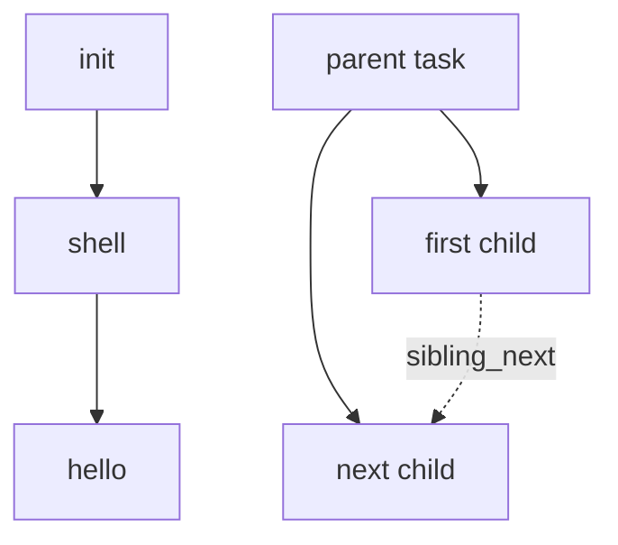
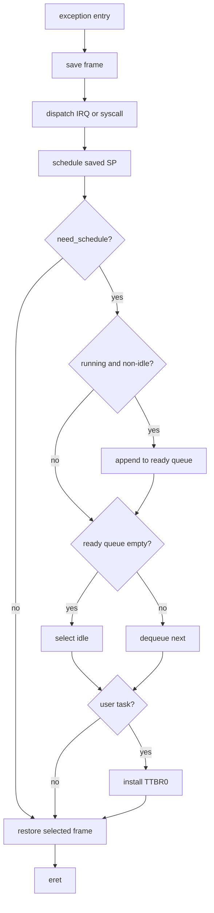

# Processes and Scheduling {#processes_scheduling}

The task layer owns execution contexts and process relationships. The scheduler
owns the queues that decide when those contexts run.

## Task representation

Each `task` records its state and PID, kernel entry and argument, kernel stack
and saved frame, time slice and wake-up tick, kernel/user mode, user `TTBR0`,
exit status, family relationships, queue link, and child wait queue. Tasks move
among ready, running, blocked, sleeping, and zombie states.

<!-- DOC-GAP(detail): Add a field-by-field task reference stating ownership,
     valid states, and which queue may use next at a time. -->

`alloc_task` obtains a zeroed object from the heap. `alloc_stack` reserves a
page, and `create_irq_frame` builds the initial context at its top. Destruction
detaches family relationships, releases the user page-table hierarchy, frees
the kernel stack, and returns the task object to the heap. As noted in
[Memory management](@ref memory_management), mapped user leaf pages currently
leak. PIDs increase monotonically from 1; PID 0 belongs to the boot task.

## Kernel threads and user processes

`kthread_create` allocates a task and stack, records its function and argument,
builds a frame targeting a trampoline, and makes it ready. If the function
returns, the trampoline makes the task a zombie and yields.

`create_user_process` additionally attaches the task to its parent and builds a
user address space. `load_user_image` copies a flat image into pages beginning at
`0x00400000` and maps a non-executable stack below `0x80000000`. On first run, a
trampoline installs `TTBR0` and enters EL0.

When a user task exits, its status is retained, its children are reparented to
init, blocked waiters are awakened, and the task becomes a zombie. Its parent
later collects and destroys it through `wait` or `waitpid`.

<!-- DOC-GAP(diagram): Add a task-state transition diagram covering creation,
     rotation, block/wake, sleep/wake, exit, wait, and reaping. -->

<!-- DOC-GAP(detail): Document rollback and lifetime rules for the task, kernel
     stack, page tables, and family links, including orphan reparenting and the
     distinct kernel-thread/user-process zombie paths. Define the policy for
     init exiting or faulting, since reparenting assumes task_init remains. -->

<!-- DOC-GAP(detail): Specify PID exhaustion/wraparound behavior and the policy
     if the initial EL0 transition unexpectedly returns or fails. -->

## Scheduling

ChaOS uses a single-core round-robin scheduler driven by timer interrupts and
explicit yields.

The ready queue is FIFO. `scheduler_init` constructs PID 0 as both boot and idle
task. Selecting a task removes the queue head, marks it running, and resets its
time slice.

Exception entry saves a frame on the current kernel stack. `schedule` records
that pointer and, when `need_schedule` is set, requeues the current task, selects
the next task, installs a user task's `TTBR0`, and returns the frame that assembly
should restore. `yield` requests a software interrupt so switching occurs
through this common exception-return path.

Each timer tick decrements the running time slice, requests a reschedule on
expiry, wakes sleepers, and periodically invokes zombie cleanup.

## Waiting, sleeping, and reaping

A wait queue holds blocked tasks in FIFO order. `task_wait` blocks and yields;
`unwait` wakes one task and `unwait_all` wakes all. UART I/O and parents waiting
for children use these queues.

<!-- DOC-GAP(rationale): Explain the single-core concurrency model, why IRQ
     masking protects queues, and why yield requests an interrupt instead of
     switching directly. -->

<!-- DOC-GAP(detail): State fairness and time-slice behavior, queue invariants,
     nested-interrupt assumptions, and what must change for SMP. -->

`task_sleep` records an absolute wake-up tick, marks the task sleeping, queues
it, and yields. Tick processing returns expired sleepers to the ready queue.

Kernel threads that return enter a zombie queue. Every `REAP_TICKS`, parentless
zombies are destroyed. User zombies stay attached to their parent until a wait
call collects their PID and status.

[ChaOS documentation](@ref mainpage)
